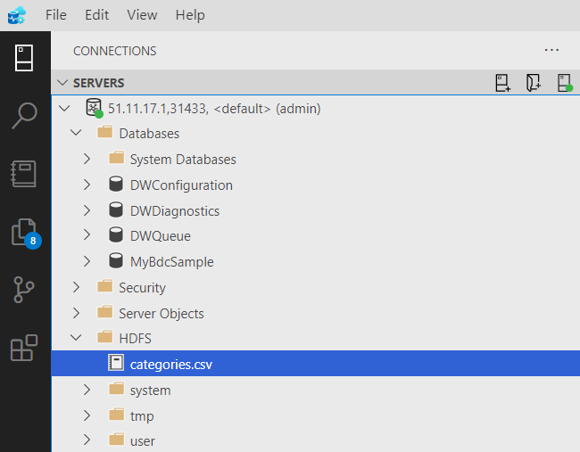

## SQL Server Big Data Clusters

[SQL Server Big Data Clusters](https://docs.microsoft.com/en-us/sql/big-data-cluster/big-data-cluster-overview?view=sql-server-ver15) allow you to virtualise big data stored in HDFS managed by SQL Server. Using T-SQL you can read, write and process data as well as combine it with data from other external data sources such as MongoDB and relational data stored in SQL Server.

SQL Server 2016 introduced [PolyBase](https://docs.microsoft.com/en-us/sql/relational-databases/polybase/polybase-guide?view=sql-server-ver15) which is the data virtualisation tool that enables SQL Server to query external data sources including HDFS without moving or copying data. SQL Server and PolyBase can be installed standalone and configured to use an external data source such as HDFS without needing to create a SQL Server Big Data Cluster. See [SQL Server and PolyBase with Hadoop on Windows](sqlserver-polybase-hadoop.md).

SQL Server 2019 introduces Big Data Clusters allowing you to deploy scalable clusters of SQL Server, Spark, and HDFS running on [Kubernetes](https://kubernetes.io). The architecture is divided into a controller, a master SQL Server instance, and three clusters:

- [Compute pool](https://docs.microsoft.com/en-us/sql/big-data-cluster/concept-compute-pool?view=sql-server-ver15) - SQL Server compute instances providing computation resource to the cluster for specific processing tasks.
- [Data pool](https://docs.microsoft.com/en-us/sql/big-data-cluster/concept-data-pool?view=sql-server-ver15) - SQL Server data mart instances providing data persistence and caching.
- [Storage pool](https://docs.microsoft.com/en-us/sql/big-data-cluster/concept-storage-pool?view=sql-server-ver15) - HDFS data nodes, each linked to a peristent volume with a SQL Server instance to read data from HDFS.

Big Data Clusters can be deployed in a variety of different ways depending on the platform choice for Kubernetes. Each deployment scenario will require different tools.

This article is going to demonstrate setting up a sample Big Data Cluster in Azure using the [Azure Kubernetes Service (AKS)](https://azure.microsoft.com/en-gb/services/kubernetes-service/).

### Prerequisites

[This article](https://docs.microsoft.com/en-us/sql/big-data-cluster/deploy-big-data-tools?view=sql-server-ver15) describes a lot of the tools necessary to manage Azure, Kubernetes and Big Data Clusters.

As well as access to Azure, you will need to install:

- [Azure CLI](https://docs.microsoft.com/en-us/cli/azure/install-azure-cli) - CLI to set up a Kubernetes cluster in AKS. Also handy for doing anything else with Azure services.
- [Azure Data CLI](https://docs.microsoft.com/en-us/sql/azdata/install/deploy-install-azdata?view=sql-server-ver15) - CLI to set up a Big Data Cluster.
- [kubectl](https://kubernetes.io/docs/tasks/tools/install-kubectl/) - CLI to manage the underlying Kubernetes cluster and view logs.
- [Azure Data Studio](https://docs.microsoft.com/en-us/sql/azure-data-studio/download-azure-data-studio?view=sql-server-ver15) - Tool for querying SQL Server. Can also connect to on-premise SQL Server instances and a good alternative to SSMS.
- [Data Virtualization extension](https://docs.microsoft.com/en-us/sql/azure-data-studio/extensions/data-virtualization-extension?view=sql-server-ver15) - Extension for Azure Data Studio that allows creating external tables and managing files in HDFS.

### Setup

Sign in to Azure with Azure CLI:

```
az login
```

This should open your default browser with the Azure sign-in page allowing you to sign in interactively. Once signed in change to a different subscription if you have multiple subscriptions available.

Create a resource group that will be a logical group in which all resources for this sample deployment are created and managed.

First, identify the region where you want to create the resources:

```
az account list-locations -o table
```

```
DisplayName               Name                 RegionalDisplayName
------------------------  -------------------  -------------------------------------
East US                   eastus               (US) East US
East US 2                 eastus2              (US) East US 2
South Central US          southcentralus       (US) South Central US
West US 2                 westus2              (US) West US 2
...
```

Create the resource group with a name e.g. `myBdcGroup` and specify a region name e.g. `uksouth`:

```
az group create --name myBdcGroup --location uksouth
```

#### Deploy an AKS cluster

A more detailed walkthrough of how to do this can be found [here](https://docs.microsoft.com/en-us/azure/aks/kubernetes-walkthrough).

Register two components `Microsoft.OperationsManagement` and `Microsoft.OperationalInsights` which will be required for the `--enable-addons monitoring` parameter which uses [Azure Monitor for containers](https://docs.microsoft.com/en-us/azure/azure-monitor/insights/container-insights-overview).

First check if these components are already registered:

```
az provider show -n Microsoft.OperationsManagement -o table
az provider show -n Microsoft.OperationalInsights -o table
```

Register them if necessary:

```
az provider register --namespace Microsoft.OperationsManagement
az provider register --namespace Microsoft.OperationalInsights
```

This example will create a cluster with a single node using parameter `--node-count 1` for evaluation purposes.

It's important here to select the right virtual machine size to match your workload, and if it's too small you will get errors during the deployment. The documentation states:

>To ensure a successful deployment and an optimal experience while validating basic scenarios on AKS, you can use a single node or a multi-node AKS cluster, with these resources available:
- 8 vCPUs across all nodes
- 64 GB of memory per VM
- 24 or more attached disks across all nodes

This example will use size `Standard_L8s`.

Create the cluster, specifying the name of the resource group created earlier and a name for the cluster e.g. `myBdcCluster`:

```
az aks create --resource-group myBdcGroup --name myBdcCluster --node-vm-size Standard_L8s --node-count 1 --enable-addons monitoring --generate-ssh-keys
```

This takes several minutes to complete.

#### Connect to the AKS cluster

Configure kubectl to connect to the cluster, specifying the name of the resource group and cluster created earlier:

```
az aks get-credentials --resource-group myBdcGroup --name myBdcCluster
```

Use kubectl to return a list of the cluster nodes:

```
kubectl get nodes
```

```
NAME                                STATUS   ROLES   AGE    VERSION
aks-nodepool1-41092677-vmss000004   Ready    agent   109s   v1.18.10
```

View the cluster configuration:

```
kubectl config view
```

#### Deploy a SQL Server Big Data Cluster on AKS

A more detailed walkthrough of how to do this can be found [here](https://docs.microsoft.com/en-us/sql/big-data-cluster/deployment-guidance?view=sql-server-ver15#deploy).

Big Data Cluster deployment configuration is defined in JSON. The Azure Data CLI `azdata` comes with default configurations that can be used to deploy to a dev-test environment.

This example will use the `aks-dev-test` configuration to deploy a cluster on AKS. Refer to the docs to find out how to list them.

To customise the configuration by creating a copy of it in a directory called `custom`:

```
azdata bdc config init --source aks-dev-test --path custom
```

This creates local files `custom\bdc.json` and `custom\control.json`.

Trigger the Big Data Cluster deployment using the `custom` folder for configuration:

```
azdata bdc create --config-profile custom --accept-eula yes
```

This will prompt you to enter an Azdata username and password.

This username and password will be used as the Big Data Cluster admin login and the sysadmin login on the SQL Server master instance.

Bootstrapping and starting up the cluster takes a very long time. During this time you should see the following messages:

```
Waiting for cluster controller to start.

Cluster controller endpoint is available at xx.xx.xx.xx:30080.

Cluster control plane is ready.

Cluster deployed successfully.
```

Wait for the message `"Cluster deployed successfully."` which will take roughly 15 to 30 minutes.

#### Retrieve endpoints

You can get the list of endpoints using kubectl. You need the name of the Big Data Cluster which defaults to `mssql-cluster`:

```
kubectl get svc controller-svc-external -n mssql-cluster
```

```
NAME                      TYPE           CLUSTER-IP    EXTERNAL-IP    PORT(S)           AGE
controller-svc-external   LoadBalancer   10.0.220.17   xx.xx.xx.xx    30080:32128/TCP   1d
```

List all pods in the namespace:

```
kubectl get pods -n mssql-cluster
```

```
NAME              READY   STATUS    RESTARTS   AGE
appproxy-ssg8p    2/2     Running   0          25m
compute-0-0       3/3     Running   0          25m
control-zs2pd     3/3     Running   0          25m
controldb-0       2/2     Running   0          25m
controlwd-r9v42   1/1     Running   0          25m
data-0-0          3/3     Running   0          25m
data-0-1          3/3     Running   0          25m
gateway-0         2/2     Running   0          25m
logsdb-0          1/1     Running   0          25m
logsui-4klcs      1/1     Running   0          25m
master-0          3/3     Running   0          25m
metricsdb-0       1/1     Running   0          25m
metricsdc-7mr88   1/1     Running   0          17m
metricsui-kzc6r   1/1     Running   0          25m
mgmtproxy-7w79b   2/2     Running   0          25m
nmnode-0-0        2/2     Running   0          25m
sparkhead-0       4/4     Running   0          25m
storage-0-0       4/4     Running   0          25m
storage-0-1       4/4     Running   0          25m
```

Log in to the Big Data Cluster with `azdata login` specifying the IP address of the controller endpoint and the username chosen earlier:

```
azdata login --endpoint https://<ip-address-of-controller-svc-external>:30080 --username <user-name>
```

List all the endpoints:

```
azdata bdc endpoint list -o table
```

```
Description                                             Endpoint                                                Name               Protocol
------------------------------------------------------  ------------------------------------------------------  -----------------  ----------
Gateway to access HDFS files, Spark                     https://xx.xx.xx.xx:30443                               gateway            https
Spark Jobs Management and Monitoring Dashboard          https://xx.xx.xx.xx:30443/gateway/default/sparkhistory  spark-history      https
Spark Diagnostics and Monitoring Dashboard              https://xx.xx.xx.xx:30443/gateway/default/yarn          yarn-ui            https
Application Proxy                                       https://xx.xx.xx.xx:30778                               app-proxy          https
Management Proxy                                        https://xx.xx.xx.xx:30777                               mgmtproxy          https
Log Search Dashboard                                    https://xx.xx.xx.xx:30777/kibana                        logsui             https
Metrics Dashboard                                       https://xx.xx.xx.xx:30777/grafana                       metricsui          https
Cluster Management Service                              https://xx.xx.xx.xx:30080                               controller         https
SQL Server Master Instance Front-End                    xx.xx.xx.xx,31433                                       sql-server-master  tds
HDFS File System Proxy                                  https://xx.xx.xx.xx:30443/gateway/default/webhdfs/v1    webhdfs            https
Proxy for running Spark statements, jobs, applications  https://xx.xx.xx.xx:30443/gateway/default/livy/v1       livy               https
```

Find the SQL Server master instance endpoint:

```
azdata bdc endpoint list -e sql-server-master
```

```
{
  "description": "SQL Server Master Instance Front-End",
  "endpoint": "xx.xx.xx.xx,31433",
  "name": "sql-server-master",
  "protocol": "tds"
}
```

#### Stop and start the cluster

Check the status of the Big Data Cluster:

```
azdata bdc status show
```


Stop, start or show the status of the AKS cluster using the resource group and name of the cluster:

```
az aks stop --resource-group myBdcGroup --name myBdcCluster
```

```
az aks start --resource-group myBdcGroup --name myBdcCluster
```

```
az aks show --resource-group myBdcGroup --name myBdcCluster
```

Remember that startup still takes a long time (around 25 minutes)!

### Connect to SQL Server using Azure Data Studio

Add a new Microsoft SQL Server connection to the server using the IP address of the SQL Server master instance endpoint found earlier.

Specify the server in the format `<ip-address-of-sql-server>,31433`.

Specify the username and password chosen earlier when creating the Big Data Cluster.

You should now be able to establish the connection.

### Create and query virtual data using HDFS

There's an official tutorial [Load sample data into a SQL Server big data cluster](https://docs.microsoft.com/en-us/sql/big-data-cluster/tutorial-load-sample-data?view=sql-server-ver15) on how to do this but it's not very obvious unless you examine the scripts line by line on what is happening.

The script bootstraps a SQL Server database backup into the cluster, then exports the data to CSV and uploads it into HDFS using the WebHDFS REST API.

[A further tutorial](https://docs.microsoft.com/en-us/sql/big-data-cluster/tutorial-query-hdfs-storage-pool?view=sql-server-ver15) then goes on to show querying that data virtually.

Here's a simpler example only showing the steps needed to upload and query data. We will avoid using the HDFS API to upload any files and use Azure Data Studio instead.

Create a new database and switch to it

```
CREATE DATABASE MyBdcSample
USE MyBdcSample
```

Create the database master key required for database scoped credentials

```
CREATE MASTER KEY ENCRYPTION BY PASSWORD = 'sql19bigdatacluster!';
```

Create an external file format for CSV data. More information about the arguments of this command and supported formats can be found [here](https://docs.microsoft.com/en-us/sql/t-sql/statements/create-external-file-format-transact-sql?view=sql-server-ver15&tabs=delimited).

```
IF NOT EXISTS(SELECT * FROM sys.external_file_formats WHERE name = 'csv_file')
BEGIN
    CREATE EXTERNAL FILE FORMAT csv_file
    WITH (
        FORMAT_TYPE = DELIMITEDTEXT,
        FORMAT_OPTIONS(
            FIELD_TERMINATOR = ',',
            STRING_DELIMITER = '"',
            FIRST_ROW = 2,
            USE_TYPE_DEFAULT = TRUE)
    );
END
```

Create an external data source for the Storage Pool:

```
IF NOT EXISTS(SELECT * FROM sys.external_data_sources WHERE name = 'SqlStoragePool')
BEGIN
    CREATE EXTERNAL DATA SOURCE SqlStoragePool
    WITH (LOCATION = 'sqlhdfs://controller-svc/default');
END
```

Create a simple CSV file:

```
echo -ne Id,Name\\n1,\"Books\"\\n2,\"Music\" > categories.csv
```

```
Id,CategoryName
1,"Books"
2,"Music"
```

In Azure Data Studio open the HDFS folder under the remote server, right-click and choose *Upload Files*. Select the `categories.csv` file just created and click *Upload*.

The CSV file should then appear in HDFS:



Create an external table for the data using the external data source and the file just uploaded:

```
IF NOT EXISTS (SELECT * FROM sys.external_tables WHERE name = 'categories')
CREATE EXTERNAL TABLE [categories] (
    Id BIGINT,
    CategoryName NVARCHAR(MAX))
WITH (
    DATA_SOURCE = SqlStoragePool,
    LOCATION = '/categories.csv',
    FILE_FORMAT= csv_file);
```

Query the data:

```
SELECT [Id]
      ,[CategoryName]
  FROM [dbo].[categories];
```


Delete the external table (doesn't delete the underlying data file from storage):

```
DROP EXTERNAL TABLE [dbo].[categories];
```

### Troubleshooting

See [Troubleshoot SQL Server Big Data Clusters Kubernetes](https://docs.microsoft.com/en-us/sql/big-data-cluster/cluster-troubleshooting-commands?view=sql-server-ver15).