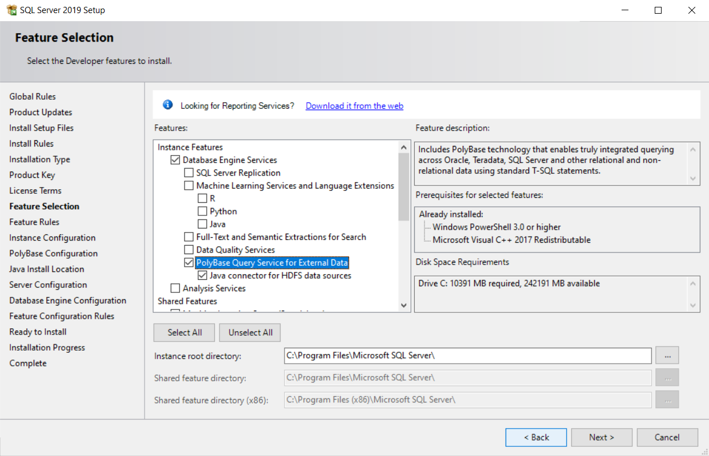
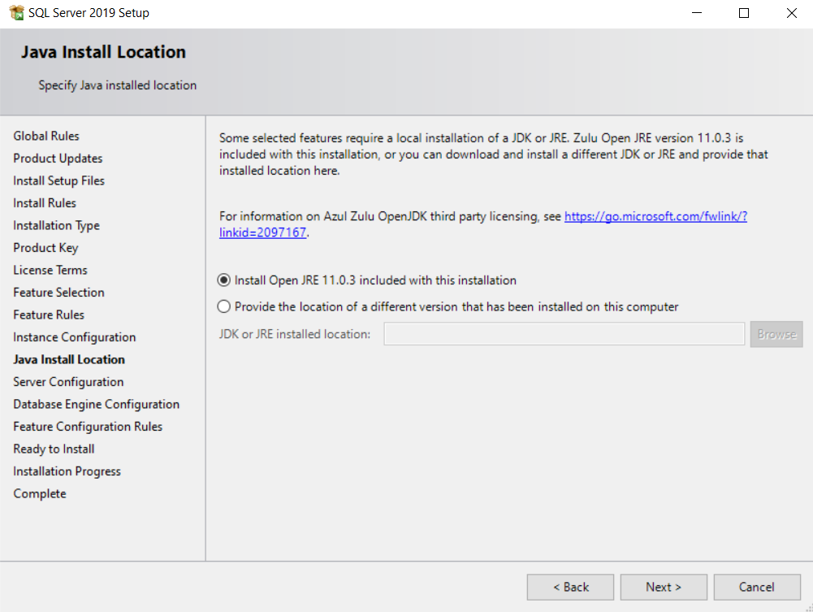

## SQL Server and PolyBase with Hadoop on Windows

In [SQL Server Big Data Clusters in Azure](sqlserver-big-data-clusters.md) I demonstrated setting up a sample SQL Server Big Data Cluster in Azure using the Azure Kubernetes Service.

In that example, SQL Server uses [PolyBase](https://docs.microsoft.com/en-us/sql/relational-databases/polybase/polybase-guide?view=sql-server-ver15) to query data from an external HDFS data source.

This article is going to look closer at the configuration of the three tools, SQL Server, PolyBase and Hadoop by showing how they can be installed standalone on Windows.

### Setup

##### Install SQL Server and PolyBase

There's an official [How-to guide on installing PolyBase on Windows](https://docs.microsoft.com/en-us/sql/relational-databases/polybase/polybase-installation?view=sql-server-ver15#enable).

Perform a new installation of SQL Server 2019 or add features to an existing instance of SQL Server 2019.

I used [SQL Server 2019 Developer Edition](https://www.microsoft.com/en-gb/sql-server/sql-server-downloads).

Select options *PolyBase Query Service for External Data* and *Java connector for HDFS data sources* during the feature part of the installation.



For this example, set-up a single SQL Server database with a PolyBase head node without creating any additional PolyBase compute nodes.

The alternative is to create a [PolyBase scale-out group](https://docs.microsoft.com/en-us/sql/relational-databases/polybase/polybase-scale-out-groups?view=sql-server-ver15) which is a cluster of SQL Server instances to process large external data sets in a parallel processing architecture. The PolyBase queries are submitted to the head node which distributes work to the compute nodes for execution.

In the PolyBase Configuration section of the installation process, select option *Use this SQL Server as standalone PolyBase-enabled instance*.

Later in the installation select the Azul Zulu Embedded OpenJDK JRE for the Java installation. Although the installer allows you to select your own version of Java, this led to errors later on for me when I was pointing at my own latest OpenJDK installation.

Continue with the Java offering out of the box by using the embedded JRE.



Connect to SQL Server and run the following command to check that PolyBase is installed:

```
SELECT SERVERPROPERTY ('IsPolyBaseInstalled') AS IsPolyBaseInstalled;
```

##### Enable PolyBase

After installation, PolyBase is not enabled by default. Enable it by connecting to SQL Server and running the following command:

```
exec sp_configure @configname = 'polybase enabled', @configvalue = 1;
RECONFIGURE;
```

Expose all http web interface ports plus 9000 for namenode and 50010 for datanode.

### Troubleshooting

#### Errors related to Java version

I got errors when using my own latest OpenJDK installation which I'd specified during setup. This was probably because Hadoop officially only supports Java 8.

The only way I found to alter the version of Java that PolyBase uses afterwards without completely reinstalling was by updating the Windows registry.

In the Windows registry check the `JavaInstalledLocation` key in `Computer\HKEY_LOCAL_MACHINE\SOFTWARE\Microsoft\Microsoft SQL Server\MSSQL15.MSSQLSERVER\Polybase\Configuration`.

Set this to the JRE that's embedded with SQL Server and is compatible with PolyBase. On my machine the location is `C:\Program Files\Microsoft SQL Server\MSSQL15.MSSQLSERVER\AZUL-OpenJDK-JRE`.

If you need to change this, restart the services.